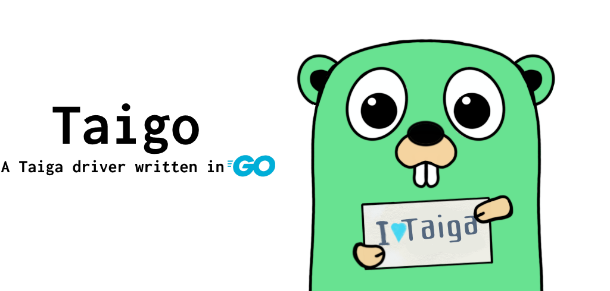

TAIGO Examples & Demo Cases
-----



# Introduction

These snippets are intentionally small and focus on one use case at a time.
They assume you put them into a valid program context and import any extra packages used by the snippet.

The examples below reflect the current `v2` API.
In particular:

- `AuthByCredentials` and `AuthByToken` initialise the client automatically.
- Project-scoped examples use `client.Project.ConfigureMappedServices(project.ID)`.
- Write examples for resource families that use dedicated write DTOs follow the `Create(...Request)` and `Edit(id, ...EditRequest)` pattern.

# Cases

## Create Client & Authenticate

```go
package main

import (
	"net/http"

	taiga "github.com/theriverman/taigo/v2"
)

func main() {
	client := taiga.Client{
		BaseURL:    "https://api.taiga.io",
		HTTPClient: &http.Client{},
	}

	if err := client.AuthByCredentials(&taiga.Credentials{
		Type:     "normal",
		Username: "admin",
		Password: "123123",
	}); err != nil {
		panic(err)
	}
}
```

## Get Self (User) `/users/me`

```go
me, err := client.User.Me()
if err != nil {
	panic(err)
}
fmt.Println("Me: (ID, Username, FullName)", me.ID, me.Username, me.FullName)
```

## Get a Project

```go
slug := "my-sassy-project-1"
fmt.Printf("Getting Project (slug=%s)..\n", slug)

project, err := client.Project.GetBySlug(slug)
if err != nil {
	panic(err)
}

fmt.Printf("Project name: %s\n", project.Name)
```

## Configure Project-Scoped Services

```go
client.Project.ConfigureMappedServices(project.ID)
```

After this, `client.Project.Epic`, `client.Project.Task`, `client.Project.Priority`, and other mapped services automatically use `project.ID` as their default project.

## Get Project Severities

This reads from the `ProjectDETAIL` meta field populated by `Get` / `GetBySlug`.

```go
fmt.Println("Project Severities:")
for _, severity := range project.ProjectDETAIL.Severities {
	fmt.Printf("  * ID=%d Name=%s\n", severity.ID, severity.Name)
}
```

## Get Project Epic Custom Attributes

```go
fmt.Println("Project Epic Custom Attributes:")
for _, epicCA := range project.ProjectDETAIL.EpicCustomAttributes {
	fmt.Printf("  * ID=%d Name=%s ProjectID=%d\n", epicCA.ID, epicCA.Name, epicCA.ProjectID)
}
```

## Get Epics For the Selected Project

This uses the mapped project-scoped service configured earlier.

```go
epics, err := client.Project.Epic.List(nil)
if err != nil {
	panic(err)
}

for i, epic := range epics[:min(len(epics), 3)] {
	fmt.Printf("  * epics[%d] :: ID=%d | Subject=%s\n", i, epic.ID, epic.Subject)

	// Access ModifiedDate via list meta because it is not present on the generic Epic.
	meta := *epic.EpicDetailLIST
	fmt.Printf("  * meta :: ModifiedDate = %s\n", meta[i].ModifiedDate.Format("2006-01-02 15:04:05"))
}
```

## Get Epic by ID

```go
epicID := 123456
fmt.Println("Getting an Epic by ID:", epicID)

epic, err := client.Epic.Get(epicID)
if err != nil {
	panic(err)
}

fmt.Println("  * epic.EpicDetailGET.ID", epic.EpicDetailGET.ID)
fmt.Printf("  * epic.Subject = %s\n", epic.Subject)
```

## Create and Edit a Priority

This demonstrates the current dedicated write DTO pattern used by resource families such as priorities, severities, issue types, statuses, and custom attributes.

```go
priority, err := client.Project.Priority.Create(&taiga.PriorityCreateRequest{
	Name:  "High",
	Color: "#d9534f",
})
if err != nil {
	panic(err)
}

priority, err = client.Project.Priority.Edit(priority.ID, &taiga.PriorityEditRequest{
	Name: "Very High",
})
if err != nil {
	panic(err)
}

fmt.Printf("Priority %d -> %s\n", priority.ID, priority.Name)
```

## Get User Story Custom Attribute Values

```go
storyID := 123456

cavs := taiga.UserStoryCustomAttribValues{}
_, err = client.Request.Get(
	client.MakeURL("userstories", "custom-attributes-values", strconv.Itoa(storyID)),
	&cavs,
)
if err != nil {
	panic(err)
}

for attrDefID, attrValue := range cavs.AttributesValues {
	fmt.Printf("  * DefinitionID=%s Value=%v\n", attrDefID, attrValue)
}
```

## Update User Story Custom Attribute Values

Taiga expects the full `attributes_values` payload together with the current `version`.

```go
storyID := 123456

updateAttributes := taiga.UserStoryCustomAttribValues{
	TgObjCAVDBase: taiga.TgObjCAVDBase{
		Version:          cavs.Version,
		AttributesValues: maps.Clone(cavs.AttributesValues),
	},
	UserStory: storyID,
}

updateAttributes.AttributesValues["1"] = "value1"
updateAttributes.AttributesValues["2"] = 987654321

_, err = client.Request.Patch(
	client.MakeURL("userstories", "custom-attributes-values", strconv.Itoa(storyID)),
	&updateAttributes,
	nil,
)
if err != nil {
	panic(err)
}
```
